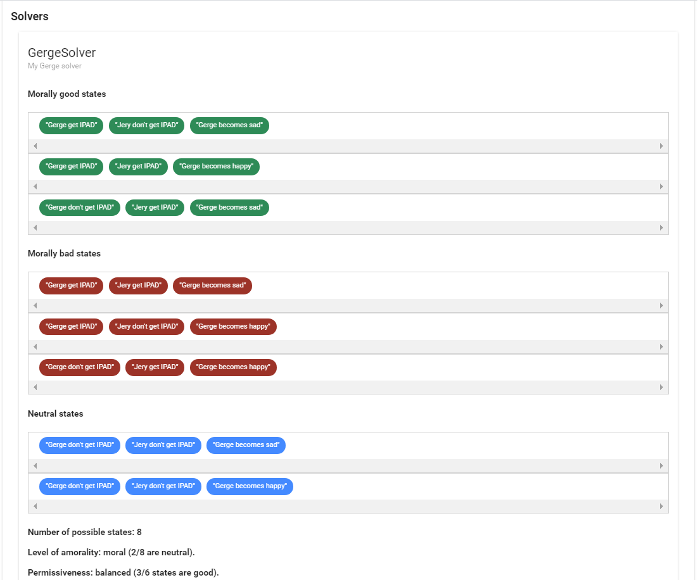

# The Logical Morality App

- [The Logical Morality App](#the-logical-morality-app)
  * [Motivation and Usage](#motivation-and-usage)
  * [Tutorial and Docs](#tutorial-and-docs)
  * [Running](#running)
    + [Compiles and hot-reloads for development](#compiles-and-hot-reloads-for-development)
    + [Compiles and minifies for production](#compiles-and-minifies-for-production)
    + [Runs tests](#runs-tests)
    + [Lints and fixes files](#lints-and-fixes-files)

<small><i><a href='http://ecotrust-canada.github.io/markdown-toc/'>Table of contents generated with markdown-toc</a></i></small>

This is a simple web application that lets its users formulate moral principles as logical rules, apply these rules to a set of hypothetical statements, and then find all possible states that satisfies the rules. Below is an example of the script:

```
// Fairness in receiving gifts.

// 1. Gerge and Jery may or may not receive IPADS
hyp GergeIPAD "Gerge get IPAD" "Gerge don't get IPAD"
hyp JeryIPAD 	"Jery get IPAD"  "Jery don't get IPAD"

// 2. Gerges reaction to him and Jery receiving, or not receiving, IPADs.
hyp GergeMood "Gerge becomes happy" "Gerge becomes sad"

// If both gets an IPAD, Gerge should be happy.
rule BothGetRule = GergeIPAD.pos and JeryIPAD.pos and GergeMood.pos is good

// If one of them gets an IPAD but not the other, Gerge should be sad.
rule MoodRuleOnlyOne = (GergeIPAD.pos xor JeryIPAD.pos) and GergeMood.neg is good

// The two rules above combined into one.
rule MoodRule = BothGetRule or MoodRuleOnlyOne

// If neither of the two gets an IPAD we will be indifferent - regardless of Gerge's mood.
rule IPADIndifferenceRule = GergeIPAD.neg and JeryIPAD.neg and GergeMood.either

solver GergeSolver "My Gerge solver"

// Apply the fairness rule.
solver GergeSolver apply MoodRule

// Omit the cases that we are indifferent to.
solver GergeSolver omit IPADIndifferenceRule

// Run the solver
solver GergeSolver run

// Print the results
solver GergeSolver print
```

The application will find all good, bad, and neutral states and list them, and also show some additional metrics such as the balance between the different types of choices.



## Motivation and Usage

This system focuses on the computational part of moral judgements, using booleans to model hypotheticals, and logical formulas for moral rules. The system does not do any interpretation of the plain speech formulations of those things. 

One could imagine formulating hypotheticals using logic, for example the hypothetical "someone did or did not steal from someone" could be:

`For all x, y where x, y are "people" : theft(x, y) = X`

where `X = true` when the hypothesis is in the positive, and `false` when in the negative, and  `theft` is a well-defined operation with some set of properties and rules for how it goes together with all other operations. That is not how this system works:

**This is a formal system that can be used by people for helping to state and test their moral principles in different situations in a very precise way, should they find that useful.**

It would be extremely hard to make a more or less complete language for modeling hypothetical statements, since a statement could be pretty much anything. None the less, this system could be used together with a simple, restricted space of possible statements such as that in a simulation, for example a computer game. In a computer game, all existing entities, their possible states, and all the possible acts that entities can perform are generally accounted for, in which case one could form a set of hypotheticals on the space (or some subspace) of those possible acts, define and apply some rules, and then evaluate. This would make it possible to simulate moral preferences of game entities using the technique found here, and to find the moral values of complex combinations of game events. That is not what this app does, though, and it may also not be a good idea in practice.

## Tutorial and Docs

A tutorial can be found here: aaaaa.

The documentation for the app can be found here: aaaaa.

## Running
```
npm install
```

### Compiles and hot-reloads for development
```
npm run serve
```

### Compiles and minifies for production
```
npm run build
```

### Runs tests
```
npm run test
```

### Lints and fixes files
```
npm run lint
```
